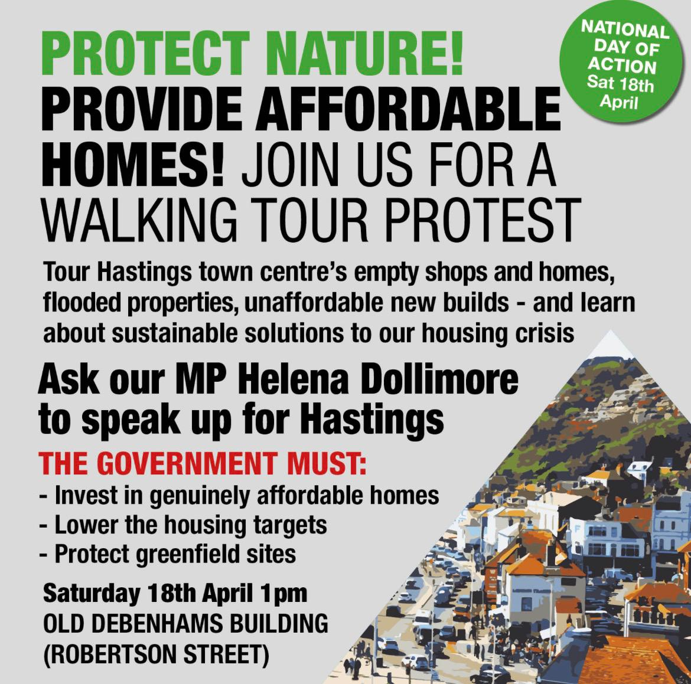
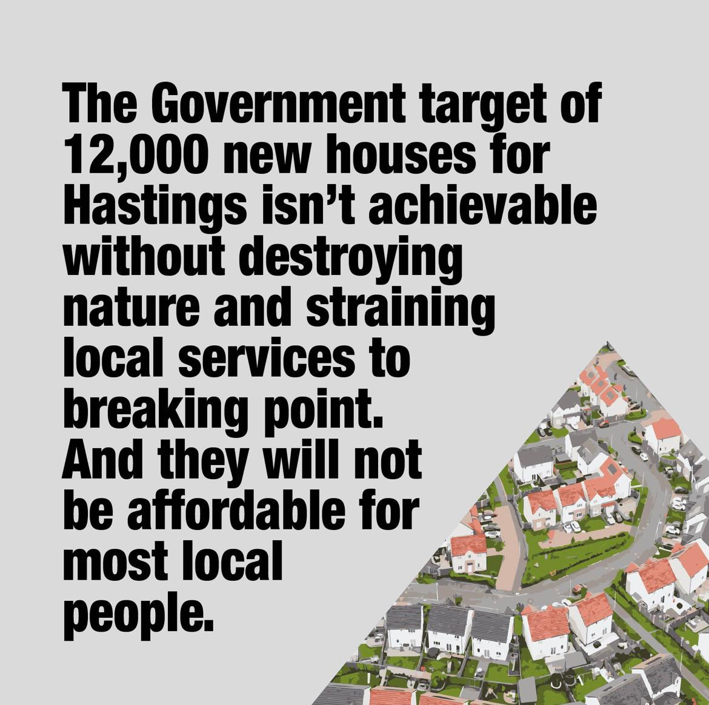

Hastings Council is creating a Local Plan. It sets out the vision for our town for the next 20 years.

But will it be a plan for developers? To build housing we can't afford on our green spaces?

Or will it be a plan for our communities? One that meets our need for affordable housing, amenities and public transport, and protects our green spaces for all of us?

The public consultation has now closed, but you can still ask our MP, Helena Dollimore, to stand up for Hastings!

  
  
  

  <iframe src='https://youtube.com/embed/Wf1JT6btquo'></iframe>

This website will link to the various campaigns and articles by local people who want to make the plan better for communities and our environment. If you want to add your campaign group details please email **communitiesvdevelopers@gmail.com**

---

## Key points to raise in consultation on the Local Plan:

### Remove all green spaces from the list of areas designated for development.

- Tilekiln Farm (Fairlight Road)
- Sandrock Bends (land adjacent Sandrock Park)
- Graystone Lane (beside Speckled Wood)
- Rock Lane
- Breadsell by Marline Valley
- Winchelsea Lane
- Beaneys Lane
- Seaside Road (Old Bathing Pool Site)
- Former Convent playing fields on Magdalene Road

All these sites need to be protected from overdevelopment to safeguard the nature we all depend on, to mitigate increased risk from flooding, coastal erosion and sea level rise, and as amenity open spaces that can greatly benefit the physical and mental health of Hastings residents. Green areas between nature reserves are vital to allow wildlife to move around.

### Retrofit first, then build sustainable new homes on brownfield (not greenfield) sites.

To reduce carbon emissions from construction, and protect green spaces, the Plan should:

- Prioritise converting old buildings into accessible, easy to heat, and affordable housing.
- Remove unnecessary building conservation rules that discourage reuse and repurposing of existing buildings.
- Demand genuinely 'net zero' new buildings, that measures embodied carbon from their construction as well as emissions from heating and lighting them. For example, factory built panels in renewable materials can be used to make modular homes that are quick and clean to assemble.
- Encourage mixed use development by putting homes on sites that are currently only for commercial or industrial use, and in 'air-space' above car parks.

Use suitable brownfield sites for new developments to include the following (totalling 266):

**Additional homes by extending existing buildings:**
- Former Italian Way building, Castle street - 50 homes
- Clifton Court - 24 homes

**'Air-space' developments above car parks (retaining use of car parks):**
- Sydney Close (four courts hub) - 100 homes
- Castle Hill Road - 20 homes
- St Margarets Rd - 24 homes
- Summerfields - 24 homes
- The Bourne - 12 homes
- Crystal Square - 12 homes

### Build communities not commodities - demand truly affordable housing for all

- Demand 100% of new housing is genuinely affordable. The current plan has 75 - 60% of new housing NOT affordable but the plan says we need 432 social homes every year to meet demand.
- Ban the use of any new residential housing for holiday homes or Air BnBs.
- Promote increased density on previously developed land while ensuring developments are accompanied by the provision of proper community amenities and infrastructure: bus routes, footpaths, spaces for socialising, sports, play, gardening etc and easy access to shops, healthcare, education and nature.
- Give strategic priority to community-led development and preferential support for co-ops, community self-builds, and community land trusts.

### Change the aim for these 'Housing Renewal' areas from demolition to refurbishment

- Four Courts
- Clifton Court
- Earl Street

All these social housing flats identified for demolition (redevelopment) could be refurbished and extended to provide additional accessible, energy-efficient homes, without the expense, pollution, disruption and carbon emissions of demolishing and rebuilding.

Housing Associations must not be permitted to demolish social housing (or leave them empty for years as with Clifton Court) without providing any evidence they have explored options for refurbishment, or guarantees that the new housing will remain genuinely affordable.

---

## Click the links below for more information about the community campaigns who want to challenge the Local Plan:

- [Standing Up 4 Nature](/assets/SU4N%20Response%20to%20Hastings%20Local%20Plan%20Consultation.pdf) - detailed proposals document to create a Local Plan for nature and affordable homes.
- [Save Sandrock Bends](https://www.savesandrockbends.co.uk/)
- [Save Tilekiln Fields](./assets/TILEKILN%20FIELDS%20FLYER_260127_103117.pdf)
- [Protect Ore Green Spaces](./assets/A4%20Flier%20Final%20Version.pdf) - flyer for their upcoming meeting - join [WhatsApp group](https://chat.whatsapp.com/JrXjpk1tRnF4L3ka1P3rzc)
- [Don't Concrete the Convent](https://www.facebook.com/profile.php?id=61584946118558)
- [Save our Bathing Pool Site](https://www.facebook.com/groups/saveourbathingpoolsite/)
- [Refurbish Don't Demolish - Clifton Court and the Four Courts](https://refurbishdontdemolish.co.uk/posts/hastings.html)
- [Hastings Rental Health Co-op](https://hastingsrentalhealthcoop.org/hbc-local-plan-for-co-ops)
- [Hastings Urban Bikes](https://www.hastingsurbanbikes.org/) - advocating for cycling and campaigning for better cycle infrastructure in Hastings. Give your feedback on cycling in Hastings [using this survey](https://forms.office.com/pages/responsepage.aspx?id=VvjjDz8urE-VCHmBFUlxo9YLIcYq3dhLvnQ9HVVupkRUNUw0UVoyMzRIMTJIQldQWVQ0OFJMRTRXMy4u&route=shorturl&fbclid=Iwb21leAQiTHljbGNrBCJMdmV4dG4DYWVtAjExAHNydGMGYXBwX2lkDDM1MDY4NTUzMTcyOAABHiTxlEfwUYoLRGdACuRA2dyGwBygImHgxzPhgzzr-tVRKEeBnxt33KFh0YxV_aem_CYazh4aFuYno0Zd4DTtyOg)
- [Save Breadsell Woods](https://www.facebook.com/share/g/1AeRNPQymV/?mibextid=wwXIfr) - join their facebook group here
- [Save Speckled Woods](https://www.orecommunitylandtrust.org.uk/speckled-wood-under-threat-again/)

## Resources for alternative local plan ideas -

Sustainable new housing proposals (above car parks and on other brownfield sites) by Urban View architects:
[Modular sustainable housing proposals](./assets/Hastings%20BC%20Greyfield%20Capacity%20Study-extract%2029.05.24%20(4).pdf)
[Crystal Square Car Park](https://www.little-ships.org/locations/hastings/crystal-sq/)
[Four Courts](https://www.little-ships.org/locations/hastings/four-courts/)
[Clifton Court](https://www.little-ships.org/locations/hastings/clifton-court/)

See the [Local Nature Recovery Strategy](https://sussexnaturerecovery.org.uk/publications), which could be included in the Plan
